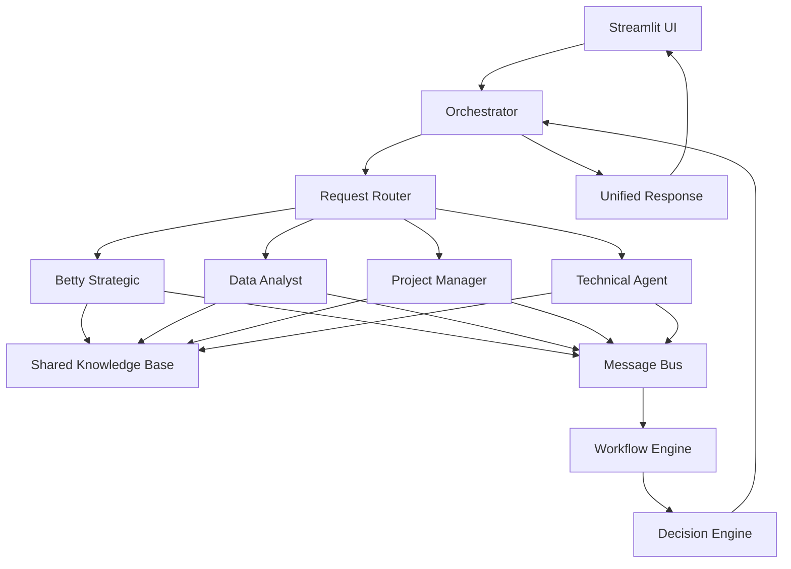

# Betty AI Assistant - Deployment Checklist & Enhancements

## ✅ Streamlit Cloud Deployment Compatibility

### Current Implementation Status
- ✅ **SQLite3 Compatibility**: Properly handled with pysqlite3-binary fallback
- ✅ **ChromaDB In-Memory Mode**: Auto-detects cloud environment and uses in-memory storage
- ✅ **API Keys Management**: Uses st.secrets for secure key storage
- ✅ **Knowledge Base Auto-Init**: Automatically loads documents on cloud deployment
- ✅ **Environment Detection**: Multiple methods to detect Streamlit Cloud environment

### Deployment Requirements Verified
```python
# requirements.txt includes all necessary packages:
- streamlit
- pysqlite3-binary (for SQLite compatibility)
- chromadb==0.4.18 (pinned version for stability)
- All AI providers (openai, anthropic)
- Document processing libraries
- Visualization tools (plotly, streamlit-mermaid)
```

### Pre-Deployment Checklist
1. **Secrets Configuration** (.streamlit/secrets.toml):
   ```toml
   ANTHROPIC_API_KEY = "your-key-here"
   OPENAI_API_KEY = "your-key-here"
   ```

2. **Documents Folder**: Ensure /docs folder contains knowledge base files:
   - Betty for Molex GPS.docx
   - Molex Manufacturing BA Reference Architecture.docx
   - Any additional reference documents

3. **Memory Management**: Cloud deployment uses in-memory ChromaDB (ephemeral)

## 🚀 New Features Implemented

### 1. Copy-to-Clipboard Component ✅
- **Implementation**: Added clipboard_helper.py utility
- **Features**:
  - JavaScript-based copy functionality
  - Visual feedback on successful copy
  - Fallback for older browsers
  - Works in both secure (HTTPS) and local contexts
  - Clean inline button design next to feedback buttons

## 🎯 Betty as an Orchestration Agent - Enhancement Recommendations

### Current Capabilities
Betty currently excels at:
- Strategic transformation consulting
- Outcome-Based Thinking (OBT) methodology
- Knowledge retrieval from embedded documents
- Interactive Q&A with feedback collection

### Recommended Orchestration Enhancements

#### 1. **Multi-Agent Coordination Framework**
```python
class AgentOrchestrator:
    """
    Central orchestrator for managing multiple specialized agents
    """
    def __init__(self):
        self.agents = {
            "strategic": BettyStrategicAgent(),
            "data_analyst": DataAnalysisAgent(),
            "project_manager": ProjectManagementAgent(),
            "technical": TechnicalImplementationAgent()
        }
    
    def route_request(self, query):
        # Intelligent routing based on query intent
        intent = self.classify_intent(query)
        return self.agents[intent].process(query)
    
    def coordinate_agents(self, complex_task):
        # Break down complex tasks and coordinate multiple agents
        subtasks = self.decompose_task(complex_task)
        results = {}
        for subtask in subtasks:
            agent = self.select_best_agent(subtask)
            results[subtask.id] = agent.execute(subtask)
        return self.synthesize_results(results)
```

#### 2. **Task Decomposition & Delegation**
- **Capability**: Break complex requests into subtasks
- **Implementation**:
  ```python
  def decompose_strategic_initiative(initiative):
      return {
          "analysis": "Analyze current state",
          "outcomes": "Define measurable outcomes",
          "kpis": "Establish KPIs",
          "roadmap": "Create implementation roadmap",
          "risks": "Identify risks and mitigations"
      }
  ```

#### 3. **Inter-Agent Communication Protocol**
```python
class AgentMessage:
    def __init__(self, sender, recipient, content, priority="normal"):
        self.sender = sender
        self.recipient = recipient
        self.content = content
        self.priority = priority
        self.timestamp = datetime.now()
        self.requires_response = True

class MessageBus:
    def publish(self, message: AgentMessage):
        # Route messages between agents
        pass
    
    def subscribe(self, agent_id, message_types):
        # Allow agents to subscribe to specific message types
        pass
```

#### 4. **Workflow Automation Engine**
```python
class WorkflowEngine:
    """
    Define and execute multi-step workflows across agents
    """
    workflows = {
        "strategic_transformation": [
            ("assess", "strategic"),
            ("analyze_data", "data_analyst"),
            ("define_outcomes", "strategic"),
            ("create_roadmap", "project_manager"),
            ("validate", "strategic")
        ]
    }
    
    def execute_workflow(self, workflow_name, context):
        steps = self.workflows[workflow_name]
        for step_name, agent_type in steps:
            result = self.execute_step(step_name, agent_type, context)
            context.update(result)
        return context
```

#### 5. **Agent Capability Registry**
```python
AGENT_CAPABILITIES = {
    "betty_strategic": {
        "specialties": ["OBT", "GPS mapping", "KPI definition"],
        "input_types": ["text", "documents"],
        "output_types": ["outcomes", "recommendations", "diagrams"]
    },
    "data_analyst": {
        "specialties": ["data processing", "visualization", "metrics"],
        "input_types": ["csv", "json", "database"],
        "output_types": ["charts", "insights", "reports"]
    },
    "project_manager": {
        "specialties": ["planning", "resource allocation", "timeline"],
        "input_types": ["requirements", "constraints"],
        "output_types": ["gantt", "milestones", "assignments"]
    }
}
```

#### 6. **Shared Knowledge Base & Context**
```python
class SharedContext:
    """
    Maintains shared state and knowledge across all agents
    """
    def __init__(self):
        self.conversation_history = []
        self.project_context = {}
        self.knowledge_base = betty_vector_store
        self.user_preferences = {}
        self.active_initiatives = []
    
    def update_context(self, agent_id, update):
        # Thread-safe context updates
        pass
    
    def get_relevant_context(self, agent_id, query):
        # Return context relevant to specific agent and query
        pass
```

#### 7. **Decision Making & Consensus**
```python
class DecisionEngine:
    def gather_recommendations(self, decision_point, agents):
        recommendations = {}
        for agent in agents:
            recommendations[agent.id] = agent.recommend(decision_point)
        return recommendations
    
    def reach_consensus(self, recommendations):
        # Weighted voting based on agent expertise
        # Conflict resolution strategies
        # Final decision synthesis
        pass
```

### Implementation Roadmap

#### Phase 1: Foundation (Week 1-2)
- [ ] Implement AgentOrchestrator base class
- [ ] Create agent registration system
- [ ] Build message passing infrastructure
- [ ] Add agent capability discovery

#### Phase 2: Core Agents (Week 3-4)
- [ ] Develop DataAnalysisAgent
- [ ] Create ProjectManagementAgent
- [ ] Build TechnicalImplementationAgent
- [ ] Implement ReportingAgent

#### Phase 3: Integration (Week 5-6)
- [ ] Connect agents to shared knowledge base
- [ ] Implement workflow engine
- [ ] Add inter-agent communication
- [ ] Create unified UI for orchestration

#### Phase 4: Advanced Features (Week 7-8)
- [ ] Add learning and adaptation
- [ ] Implement feedback loops
- [ ] Create agent performance metrics
- [ ] Build orchestration dashboards

### Technical Architecture



### Integration Points

1. **API Gateway Pattern**
   ```python
   @app.route('/orchestrate')
   def orchestrate_request():
       request_data = request.json
       orchestrator = AgentOrchestrator()
       response = orchestrator.process(request_data)
       return jsonify(response)
   ```

2. **Event-Driven Architecture**
   ```python
   class EventBus:
       events = {
           "outcome_defined": ["project_manager", "data_analyst"],
           "data_analyzed": ["strategic", "reporting"],
           "milestone_reached": ["all"]
       }
   ```

3. **Plugin System for New Agents**
   ```python
   class AgentPlugin:
       def register(self, orchestrator):
           orchestrator.add_agent(self.agent_id, self)
       
       def capabilities(self):
           return self.CAPABILITIES
   ```

### Monitoring & Observability

```python
class OrchestrationMetrics:
    metrics = {
        "request_routing_time": [],
        "agent_response_times": {},
        "workflow_completion_rates": {},
        "inter_agent_messages": 0,
        "decision_consensus_time": []
    }
    
    def track_performance(self):
        # Real-time performance tracking
        pass
    
    def generate_dashboard(self):
        # Create orchestration dashboard
        pass
```

### Security & Governance

1. **Agent Authorization**
   - Role-based access control for agents
   - Capability-based permissions
   - Audit logging for all agent actions

2. **Data Privacy**
   - Implement data isolation between agents
   - Encryption for inter-agent communication
   - Compliance with data governance policies

3. **Rate Limiting & Resource Management**
   ```python
   class ResourceManager:
       def allocate_resources(self, agent_id, requested):
           # Fair resource allocation
           # Priority-based scheduling
           # Prevent resource starvation
           pass
   ```

## Summary

Betty is well-positioned to evolve into a powerful orchestration agent. The proposed enhancements would transform Betty from a single-purpose strategic advisor into a sophisticated multi-agent orchestrator capable of:

1. **Coordinating specialized agents** for complex tasks
2. **Breaking down and delegating** work efficiently
3. **Maintaining shared context** across all agents
4. **Learning and adapting** from interactions
5. **Providing unified responses** from multiple agent inputs

The modular architecture ensures that new agents can be easily added as plugins, making the system highly extensible for future needs.